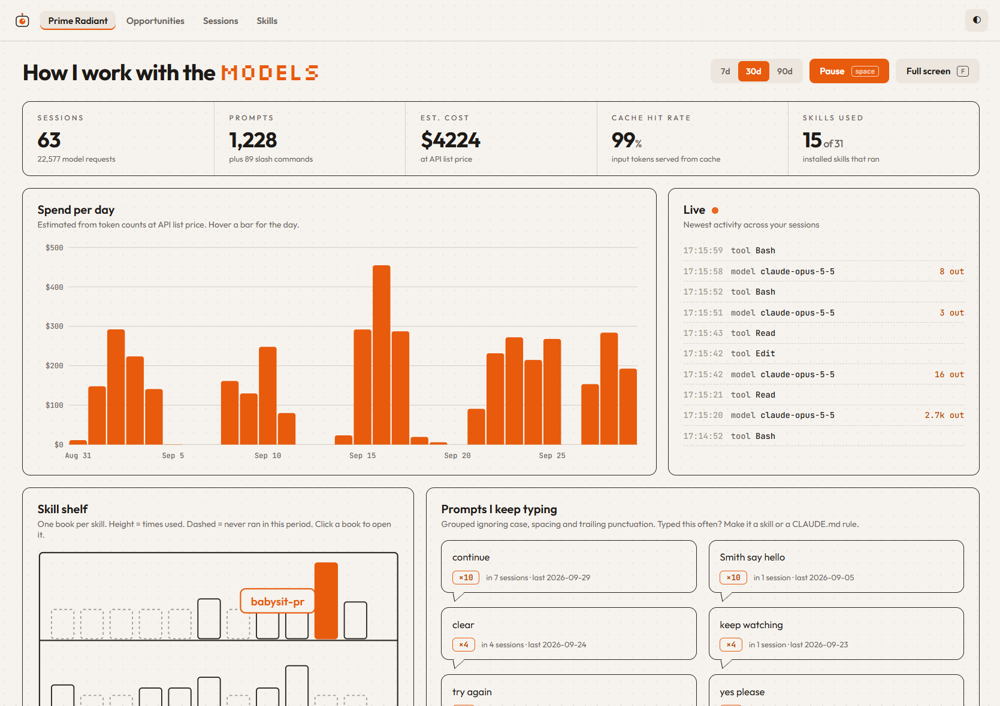

<p align="center"></p>

# calvin

**Learn how you actually use AI coding agents.** One binary, fully local.

> Named after Dr Susan Calvin, the robopsychologist in Isaac Asimov's *I, Robot*. Her job was
> working out why a robot behaved the way it did. calvin does the same for you and your agents.

calvin reads the session logs your AI harnesses already write to disk (Claude Code and
GitHub Copilot CLI),
loads them into a local SQLite database, and shows you:

- **Prompts you keep typing**, which should become skills or `CLAUDE.md` rules
- **Skills that never trigger**, and prompts a skill should have caught
- **Cost and cache hit rate** per day, project and model (estimated at API list price)
- **Friction**: denied tool calls, interruptions, "no, that's wrong" replies
- **Opportunities**: Claude Code and Copilot CLI features and habits you could be using and aren't



> **Status:** v0.1.0 is out. The current branch supports Claude Code and GitHub Copilot CLI
> on Windows, macOS and Linux.

## The dashboard

- **Prime Radiant**: the overview. Sessions, prompts, estimated cost, cache hit rate and
  skills used for the last 7, 30 or 90 days; spend per day and per project; a live feed of
  activity across your sessions; a skill shelf; prompts you keep typing; friction; and
  which models did the work and at what effort. Keys: `space` pauses the live feed, `F` is
  full screen, `T` switches light and dark, and `1` `2` `3` pick the period.
- **Opportunities**: checks your history, CLI settings and projects for features
  and habits worth adopting, each with what calvin found, why it matters, how to fix it and
  the evidence. Cross-tool projects can consolidate shared instructions in `AGENTS.md`, with
  a small `CLAUDE.md` importing it only when Claude-specific guidance is needed. Trends show
  whether things are improving. **Ask for a plan** has an AI tool
  of your choice turn the report into a prioritised plan with drafts you can use; earlier
  plans are kept.
- **Sessions**: browse and read past sessions, jump to the friction points in each (what
  went wrong and what you said next), and copy a command to resume one in Claude Code.
- **Skills**: every installed skill, grouped by where it comes from, with how often it
  ran. Open its folder, copy its location, or tick several and pack them into one zip for a
  colleague. The packer skips build folders, ignored files and likely secrets, and flags
  anything that looks like a credential.

## Local only

Your session logs contain prompts, source code and often confidential details. calvin:

- never sends data anywhere: no telemetry, no accounts, no cloud
- makes one network call on its own: while running, it asks GitHub once a day whether a
  newer release exists, so it can tell you. That request carries nothing about you or your
  usage. Turn it off with `[updates] check = false` in `config.toml`
- sends your data only when you ask it to: **Ask for a plan** on the Opportunities page
  passes the report (findings, numbers, and evidence such as repeated prompts and rejected
  commands) to the AI tool you choose. **Preview what is sent** shows exactly what calvin
  sends; **Copy as prompt** lets you paste it yourself instead
- never writes to your harness folders or skill folders
- serves its dashboard on `127.0.0.1` only

## Install

```powershell
# Windows (PowerShell)
irm https://raw.githubusercontent.com/jmelosegui/calvin/main/docs/install.ps1 | iex
```

```sh
# macOS / Linux
curl -fsSL https://raw.githubusercontent.com/jmelosegui/calvin/main/docs/install.sh | sh
```

The scripts download the latest release for your platform, verify its checksum, and put
`calvin` in `%LOCALAPPDATA%\calvin\bin` (Windows) or `~/.local/bin` (macOS, Linux). Run them
again to update; a running calvin is stopped and restarted for you.

Prebuilt for Windows x64, Linux x64/arm64 (static) and macOS x64/arm64. Anything else, or
from source (Rust 1.95+):

```sh
cargo install --git https://github.com/jmelosegui/calvin
```

There are no other dependencies. The dashboard, its fonts and SQLite are all built into the
one binary.

## Usage

```sh
calvin start   # import your history, keep following your sessions, open the dashboard
calvin stop    # stop it
```

That's it. `calvin start` runs in the background and serves the dashboard at
`http://127.0.0.1:1982` (or the next free port). Close the terminal and it keeps running
until `calvin stop`. Use `calvin start --no-open` to skip the browser, or `--foreground` to
run it in the terminal (for debugging or a service manager).

Also available:

```sh
calvin status                  # is it running, on which URL, how fresh the data is
calvin open                    # reopen the dashboard in your browser
calvin ingest                  # import new activity without starting the dashboard
calvin                         # import and print a 30-day summary in the terminal
calvin report                  # the same summary; every report takes --since
calvin report skills           # skills the model ran
calvin report commands         # slash commands you typed
calvin report prompts --min 3  # prompts you keep typing
calvin report friction         # rejected / denied tool calls, interruptions, errors
calvin report cache            # prompt-cache hit rate per model
calvin report cost --by project --since 4w
calvin doctor                  # what was detected, where, and log retention warnings
```

`--since` accepts `7d`, `4w`, `3m`, `all` or a date such as `2026-09-01`. The default is `30d`.

## How it works

```
                                  ┌──────────── calvin start ────────────┐
~/.claude/projects/**/*.jsonl ───┐ │                                      │
~/.copilot/session-state + DB ───┼─► catch up + follow ──► SQLite ──► dashboard ──► 127.0.0.1:1982
skill folders ───────────────────┘ │                                      │
                                  └──────────── calvin stop ─────────────┘
```

- **One process:** it imports, watches and serves the dashboard together. One start, one stop.
- **Backfill:** your whole history is imported on first run, not just what happens from now on.
- **No hooks:** new data is picked up by watching the log files, so calvin can't slow down
  or break your sessions.
- **Adapters:** each harness is a small parser. Claude Code and Copilot CLI ship with calvin;
  others are welcome.

## Supported harnesses

| Harness | Status |
|---|---|
| Claude Code | supported since v0.1.0 |
| GitHub Copilot CLI | supported from local session-state and session-store data |
| Codex CLI, Gemini CLI, Cursor, Aider | contributions welcome |

## Configuration

Optional. Everything works with defaults. `config.toml` lives in your OS config directory.

```toml
[paths]
claude_dir = "~/.claude"          # Claude Code's folder (or set CLAUDE_CONFIG_DIR)
copilot_dir = "~/.copilot"        # GitHub Copilot CLI's local data folder

[skills]
extra_paths = ["~/other/skills"]  # more places where skills are installed

[updates]
check = true                      # once a day, ask GitHub whether a newer calvin exists

[advisor]                         # who writes plans on the Opportunities page
provider = "claude-code"          # "claude-code", "copilot-cli", or "command"

[advisor.claude-code]
program = "claude"
model = "claude-sonnet-5"
max_budget_usd = 1.0              # spending cap per plan
research = true                   # let it read the official docs (web fetch and search only)
docs_index = "https://code.claude.com/docs/llms.txt"

[advisor.copilot-cli]
program = "copilot"
model = "auto"
max_ai_credits = 50               # guardrail per plan (Copilot minimum is 30)

[advisor.command]                 # any tool: prompt on stdin, Markdown on stdout
name = "My tool"                  # shown on the button
program = "my-tool"
args = []
docs_index = ""                   # optional: the tool's documentation index

[prices.models]                   # USD per million tokens; overrides the built-in table
# "model-id" = { input = 0.0, output = 0.0, cache_write_5m = 0.0, cache_write_1h = 0.0, cache_read = 0.0 }
```

The advisor settings can also be changed from the Opportunities page. `CALVIN_CONFIG` and
`CALVIN_DATA_DIR` override where the config file and the database live.

## Contributing

The most useful contribution is a new harness adapter. Adapters ship with **hand-written,
anonymised fixtures**. Never commit or attach real transcripts, and redact anything you
paste into an issue. [docs/claude-code-data.md](docs/claude-code-data.md) and
[docs/copilot-cli-data.md](docs/copilot-cli-data.md) describe what each supported CLI writes
to disk and what calvin reads. Details in `CONTRIBUTING.md` (coming).

## License

Licensed under the [MIT License](LICENSE).

The bundled fonts are under the SIL Open Font License; see [web/fonts/OFL.txt](web/fonts/OFL.txt).
